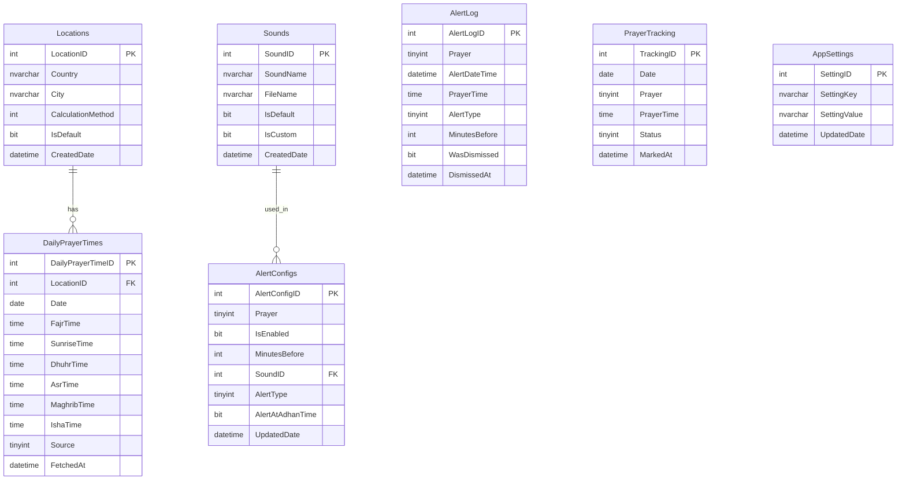

# 🗄️ Salati — Database Documentation

> قاعدة البيانات: **SQL Server** (SalatiDB)
> Connection: `Server=.;Database=SalatiDB;Trusted_Connection=True;TrustServerCertificate=True`
> Data Access: **ADO.NET + Stored Procedures** (نفس نمط DVLD و Aura)

---

## 📋 ملخص الجداول

| # | الجدول | الوصف | العلاقات |
|---|--------|-------|----------|
| 1 | `Locations` | المواقع المحفوظة (دول ومدن) | → DailyPrayerTimes |
| 2 | `DailyPrayerTimes` | مواعيد الصلاة اليومية (Cache) | ← Locations |
| 3 | `Sounds` | أصوات الأذان المتاحة | → AlertConfigs |
| 4 | `AlertConfigs` | إعدادات التنبيه لكل صلاة | ← Sounds |
| 5 | `AlertLog` | سجل التنبيهات (History) | — |
| 6 | `PrayerTracking` | تتبع الصلاة (v1.5) | — |
| 7 | `AppSettings` | إعدادات التطبيق (Key-Value) | — |

**الإجمالي: 7 جداول**

---

## 📊 ERD (Entity Relationship Diagram)



---

## 📝 تفاصيل كل جدول

---

### 1. Locations — المواقع المحفوظة

> يحفظ المدن اللي المستخدم استخدمها لجلب مواعيد الصلاة من الـ API.

| Column | Type | Constraint | Description |
|--------|------|------------|-------------|
| `LocationID` | `INT` | PK, IDENTITY(1,1) | المعرف |
| `Country` | `NVARCHAR(100)` | NOT NULL | الدولة (مثل: Egypt) |
| `City` | `NVARCHAR(100)` | NOT NULL | المدينة (مثل: Cairo) |
| `CalculationMethod` | `INT` | NOT NULL, DEFAULT 5 | طريقة الحساب (5 = Egyptian) |
| `Latitude` | `DECIMAL(9,6)` | NULL | خط العرض (اختياري) |
| `Longitude` | `DECIMAL(9,6)` | NULL | خط الطول (اختياري) |
| `IsDefault` | `BIT` | NOT NULL, DEFAULT 0 | الموقع الافتراضي |
| `CreatedDate` | `DATETIME` | NOT NULL, DEFAULT GETDATE() | تاريخ الإضافة |

**القيود:**
- `UNIQUE(Country, City)` — مينفعش نفس المدينة تتكرر
- **موقع واحد بس يكون Default** — الكود يتأكد

**طرق الحساب (CalculationMethod):**

| القيمة | الطريقة | المنطقة |
|--------|---------|---------|
| 1 | University of Islamic Sciences, Karachi | باكستان |
| 2 | Islamic Society of North America (ISNA) | أمريكا |
| 3 | Muslim World League (MWL) | عالمي |
| 4 | Umm Al-Qura University, Makkah | السعودية |
| **5** | **Egyptian General Authority of Survey** | **مصر** (افتراضي) |
| 7 | Institute of Geophysics, University of Tehran | إيران |
| 8 | Gulf Region | الخليج |
| 9 | Kuwait | الكويت |
| 10 | Qatar | قطر |
| 11 | Majlis Ugama Islam Singapura | سنغافورة |
| 12 | UOIF (France) | فرنسا |
| 13 | Diyanet İşleri Başkanlığı | تركيا |
| 15 | Moonsighting Committee | عالمي |

---

### 2. DailyPrayerTimes — مواعيد الصلاة اليومية

> يخزن مواعيد الصلاة لكل يوم — سواء جت من API أو أدخلها المستخدم يدوي.
> يعمل كـ **Cache** — لو الإنترنت قطع، الأوقات المحفوظة تشتغل.

| Column | Type | Constraint | Description |
|--------|------|------------|-------------|
| `DailyPrayerTimeID` | `INT` | PK, IDENTITY(1,1) | المعرف |
| `LocationID` | `INT` | FK → Locations, NULL | الموقع (NULL لو يدوي) |
| `Date` | `DATE` | NOT NULL | التاريخ |
| `FajrTime` | `TIME(0)` | NOT NULL | وقت الفجر |
| `SunriseTime` | `TIME(0)` | NULL | وقت الشروق |
| `DhuhrTime` | `TIME(0)` | NOT NULL | وقت الظهر |
| `AsrTime` | `TIME(0)` | NOT NULL | وقت العصر |
| `MaghribTime` | `TIME(0)` | NOT NULL | وقت المغرب |
| `IshaTime` | `TIME(0)` | NOT NULL | وقت العشاء |
| `Source` | `TINYINT` | NOT NULL | المصدر: 1=API, 2=Manual |
| `HijriDate` | `NVARCHAR(30)` | NULL | التاريخ الهجري (من API) |
| `FetchedAt` | `DATETIME` | NOT NULL, DEFAULT GETDATE() | وقت الجلب/الإدخال |

**القيود:**
- `UNIQUE(LocationID, Date)` — يوم واحد لكل موقع
- `CHECK(Source IN (1, 2))`

**ملاحظات:**
- لما المصدر API → `LocationID` مليان و `Source = 1`
- لما المصدر يدوي → `LocationID = NULL` و `Source = 2`
- التطبيق يحذف الأيام القديمة (أكتر من 30 يوم) تلقائياً

---

### 3. Sounds — أصوات الأذان

> الأصوات المتاحة للتنبيه. فيه أصوات مدمجة (built-in) وأصوات مخصصة يضيفها المستخدم.

| Column | Type | Constraint | Description |
|--------|------|------------|-------------|
| `SoundID` | `INT` | PK, IDENTITY(1,1) | المعرف |
| `SoundName` | `NVARCHAR(100)` | NOT NULL | اسم الصوت (مثل: أذان الحرم المكي) |
| `FileName` | `NVARCHAR(255)` | NOT NULL | اسم الملف (مثل: adhan_makkah.mp3) |
| `FilePath` | `NVARCHAR(500)` | NULL | المسار الكامل (للأصوات المخصصة) |
| `DurationSeconds` | `INT` | NULL | مدة الصوت بالثواني |
| `IsDefault` | `BIT` | NOT NULL, DEFAULT 0 | الصوت الافتراضي |
| `IsBuiltIn` | `BIT` | NOT NULL, DEFAULT 1 | مدمج (مش قابل للحذف) |
| `CreatedDate` | `DATETIME` | NOT NULL, DEFAULT GETDATE() | تاريخ الإضافة |

**Seed Data (بيانات أولية):**
```
ID | SoundName              | FileName         | IsDefault | IsBuiltIn
1  | أذان الحرم المكي        | adhan_makkah.mp3 | 1         | 1
2  | أذان المدينة المنورة    | adhan_madinah.mp3| 0         | 1
3  | أذان مشاري العفاسي     | adhan_afasy.mp3  | 0         | 1
4  | تنبيه بسيط             | beep_simple.wav  | 0         | 1
5  | تنبيه مزدوج            | beep_double.wav  | 0         | 1
```

---

### 4. AlertConfigs — إعدادات التنبيه لكل صلاة

> كل صلاة لها إعدادات تنبيه مستقلة: مفعّل/معطّل، قبل بكام دقيقة، أي صوت.

| Column | Type | Constraint | Description |
|--------|------|------------|-------------|
| `AlertConfigID` | `INT` | PK, IDENTITY(1,1) | المعرف |
| `Prayer` | `TINYINT` | NOT NULL, UNIQUE | الصلاة (1-5) |
| `IsEnabled` | `BIT` | NOT NULL, DEFAULT 1 | التنبيه مفعّل؟ |
| `MinutesBefore` | `INT` | NOT NULL, DEFAULT 5 | قبل الصلاة بكام دقيقة |
| `SoundID` | `INT` | FK → Sounds, NOT NULL, DEFAULT 1 | صوت الأذان |
| `AlertType` | `TINYINT` | NOT NULL, DEFAULT 1 | نوع التنبيه |
| `AlertAtAdhanTime` | `BIT` | NOT NULL, DEFAULT 1 | تنبيه وقت الأذان كمان؟ |
| `Volume` | `INT` | NOT NULL, DEFAULT 80 | مستوى الصوت (0-100) |
| `UpdatedDate` | `DATETIME` | NOT NULL, DEFAULT GETDATE() | آخر تعديل |

**القيود:**
- `CHECK(Prayer BETWEEN 1 AND 5)`
- `CHECK(MinutesBefore BETWEEN 0 AND 120)`
- `CHECK(AlertType IN (1, 2, 3))` — 1=AdhanSound, 2=SimpleBeep, 3=WindowsNotification
- `CHECK(Volume BETWEEN 0 AND 100)`

**Seed Data:**
```
ID | Prayer | IsEnabled | MinutesBefore | SoundID | AlertType | AlertAtAdhanTime | Volume
1  | 1 (Fajr)    | 1    | 10            | 1       | 1         | 1                | 80
2  | 2 (Dhuhr)   | 1    | 5             | 1       | 1         | 1                | 80
3  | 3 (Asr)     | 1    | 5             | 1       | 1         | 1                | 80
4  | 4 (Maghrib) | 1    | 10            | 1       | 1         | 1                | 80
5  | 5 (Isha)    | 1    | 5             | 1       | 1         | 1                | 80
```

---

### 5. AlertLog — سجل التنبيهات

> يسجل كل تنبيه اتبعت للمستخدم. مفيد للإحصائيات والـ debugging.

| Column | Type | Constraint | Description |
|--------|------|------------|-------------|
| `AlertLogID` | `INT` | PK, IDENTITY(1,1) | المعرف |
| `Prayer` | `TINYINT` | NOT NULL | الصلاة (1-5) |
| `AlertDateTime` | `DATETIME` | NOT NULL, DEFAULT GETDATE() | وقت ظهور التنبيه |
| `PrayerTime` | `TIME(0)` | NOT NULL | وقت الصلاة الفعلي |
| `AlertType` | `TINYINT` | NOT NULL | نوع التنبيه |
| `MinutesBefore` | `INT` | NOT NULL | 0 = وقت الأذان |
| `WasDismissed` | `BIT` | NOT NULL, DEFAULT 0 | المستخدم ضغط "تم"؟ |
| `WasMuted` | `BIT` | NOT NULL, DEFAULT 0 | المستخدم كتم الصوت؟ |
| `AutoDismissed` | `BIT` | NOT NULL, DEFAULT 0 | اتقفل تلقائياً (timeout)؟ |
| `DismissedAt` | `DATETIME` | NULL | وقت الإغلاق |

**الاستخدام:**
- إحصائيات: "كام تنبيه اتبعت الأسبوع ده"
- تحليل: "أكتر صلاة المستخدم بيكتم فيها الصوت"
- Debugging: التأكد إن التنبيهات شغالة صح
- التنظيف: حذف السجلات الأقدم من 90 يوم تلقائياً

---

### 6. PrayerTracking — تتبع الصلاة (v1.5)

> يسجل هل المستخدم صلّى في الوقت ولا لأ. **ميزة مستقبلية** لكن الجدول يتعمل من الأول.

| Column | Type | Constraint | Description |
|--------|------|------------|-------------|
| `TrackingID` | `INT` | PK, IDENTITY(1,1) | المعرف |
| `Date` | `DATE` | NOT NULL | اليوم |
| `Prayer` | `TINYINT` | NOT NULL | الصلاة (1-5) |
| `PrayerTime` | `TIME(0)` | NOT NULL | وقت الصلاة |
| `Status` | `TINYINT` | NOT NULL, DEFAULT 0 | الحالة |
| `MarkedAt` | `DATETIME` | NULL | وقت التسجيل |
| `Notes` | `NVARCHAR(200)` | NULL | ملاحظات (اختياري) |

**القيود:**
- `UNIQUE(Date, Prayer)` — صلاة واحدة ليوم واحد
- `CHECK(Prayer BETWEEN 1 AND 5)`
- `CHECK(Status IN (0, 1, 2, 3))`

**حالات Status:**

| القيمة | الحالة | الوصف |
|--------|--------|-------|
| 0 | `NotMarked` | لم يسجّل بعد |
| 1 | `OnTime` | صلّى في الوقت ✅ |
| 2 | `Late` | صلّى متأخر ⚠️ |
| 3 | `Missed` | فاتته ❌ |

---

### 7. AppSettings — إعدادات التطبيق

> key-value store لكل إعدادات التطبيق. بديل مرن عن ملف JSON.

| Column | Type | Constraint | Description |
|--------|------|------------|-------------|
| `SettingID` | `INT` | PK, IDENTITY(1,1) | المعرف |
| `SettingKey` | `NVARCHAR(100)` | NOT NULL, UNIQUE | مفتاح الإعداد |
| `SettingValue` | `NVARCHAR(500)` | NULL | القيمة |
| `DefaultValue` | `NVARCHAR(500)` | NULL | القيمة الافتراضية |
| `Category` | `NVARCHAR(50)` | NOT NULL | الفئة (تنظيم) |
| `Description` | `NVARCHAR(200)` | NULL | وصف الإعداد |
| `UpdatedDate` | `DATETIME` | NOT NULL, DEFAULT GETDATE() | آخر تعديل |

**Seed Data:**

| Key | Value | Default | Category | Description |
|-----|-------|---------|----------|-------------|
| `PrayerSource` | `API` | `API` | Prayer | مصدر المواعيد (API/Manual) |
| `DefaultLocationID` | `1` | `1` | Prayer | الموقع الافتراضي |
| `ActiveThemeName` | `Midnight Serenity` | `Midnight Serenity` | Appearance | الثيم الحالي |
| `LanguageCode` | `ar` | `ar` | Appearance | اللغة |
| `StartWithWindows` | `true` | `true` | General | تشغيل مع الويندوز |
| `MinimizeOnStart` | `false` | `false` | General | تصغير عند البدء |
| `ShowInTray` | `true` | `true` | General | إظهار في System Tray |
| `MinimizeToTray` | `true` | `true` | General | تصغير لـ Tray عند الإغلاق |
| `GlobalVolume` | `80` | `80` | Sound | مستوى الصوت العام |
| `LastFetchDate` | `NULL` | `NULL` | System | آخر مرة جبنا المواعيد من API |

---

## 🔗 العلاقات (Relationships)

```
Locations (1) ──────── (∞) DailyPrayerTimes
    └── LocationID ←──── LocationID (FK, ON DELETE SET NULL)

Sounds (1) ──────── (∞) AlertConfigs
    └── SoundID ←──── SoundID (FK, ON DELETE SET DEFAULT)
```

**ملاحظات:**
- لو حذفنا Location → مواعيد الصلاة تفضل موجودة بس `LocationID = NULL`
- لو حذفنا Sound مخصص → AlertConfig يرجع للصوت الافتراضي (ID=1)
- `AlertLog` و `PrayerTracking` مستقلين — مش مرتبطين بجداول تانية

---

## 📦 Stored Procedures

### Locations

| SP | النوع | الوصف |
|----|-------|-------|
| `SP_GetAllLocations` | READ | جلب كل المواقع |
| `SP_GetLocationByID` | READ | جلب موقع بالـ ID |
| `SP_GetDefaultLocation` | READ | جلب الموقع الافتراضي |
| `SP_AddLocation` | CREATE | إضافة موقع جديد |
| `SP_UpdateLocation` | UPDATE | تعديل موقع |
| `SP_DeleteLocation` | DELETE | حذف موقع |
| `SP_SetDefaultLocation` | UPDATE | تحديد موقع كافتراضي |

### DailyPrayerTimes

| SP | النوع | الوصف |
|----|-------|-------|
| `SP_GetPrayerTimesByDate` | READ | جلب مواعيد يوم محدد |
| `SP_GetPrayerTimesByDateRange` | READ | جلب مواعيد فترة |
| `SP_GetTodayPrayerTimes` | READ | مواعيد اليوم |
| `SP_InsertOrUpdatePrayerTimes` | UPSERT | إدخال/تحديث مواعيد يوم |
| `SP_DeleteOldPrayerTimes` | DELETE | حذف المواعيد الأقدم من X يوم |
| `SP_HasPrayerTimesForToday` | READ | هل في مواعيد لليوم؟ (للتحقق قبل API call) |

### Sounds

| SP | النوع | الوصف |
|----|-------|-------|
| `SP_GetAllSounds` | READ | كل الأصوات |
| `SP_GetSoundByID` | READ | صوت بالـ ID |
| `SP_GetDefaultSound` | READ | الصوت الافتراضي |
| `SP_AddCustomSound` | CREATE | إضافة صوت مخصص |
| `SP_DeleteCustomSound` | DELETE | حذف صوت مخصص (built-in مش بيتحذف) |

### AlertConfigs

| SP | النوع | الوصف |
|----|-------|-------|
| `SP_GetAllAlertConfigs` | READ | كل إعدادات التنبيه |
| `SP_GetAlertConfigByPrayer` | READ | إعدادات تنبيه صلاة محددة |
| `SP_UpdateAlertConfig` | UPDATE | تعديل إعدادات تنبيه صلاة |
| `SP_EnableAllAlerts` | UPDATE | تفعيل كل التنبيهات |
| `SP_DisableAllAlerts` | UPDATE | تعطيل كل التنبيهات |

### AlertLog

| SP | النوع | الوصف |
|----|-------|-------|
| `SP_InsertAlertLog` | CREATE | تسجيل تنبيه جديد |
| `SP_UpdateAlertDismissed` | UPDATE | تحديث حالة الإغلاق |
| `SP_GetAlertLogByDate` | READ | سجل تنبيهات يوم |
| `SP_GetAlertStats` | READ | إحصائيات (عدد التنبيهات حسب الصلاة) |
| `SP_CleanOldAlertLogs` | DELETE | حذف سجلات أقدم من 90 يوم |

### PrayerTracking (v1.5)

| SP | النوع | الوصف |
|----|-------|-------|
| `SP_MarkPrayer` | UPSERT | تسجيل صلاة |
| `SP_GetDailyTracking` | READ | تتبع يوم كامل |
| `SP_GetWeeklyStats` | READ | إحصائيات أسبوعية |
| `SP_GetMonthlyStats` | READ | إحصائيات شهرية |
| `SP_GetStreakCount` | READ | عدد أيام الالتزام المتتالية 🔥 |

### AppSettings

| SP | النوع | الوصف |
|----|-------|-------|
| `SP_GetAllSettings` | READ | كل الإعدادات |
| `SP_GetSettingByKey` | READ | إعداد بالمفتاح |
| `SP_GetSettingsByCategory` | READ | إعدادات حسب الفئة |
| `SP_UpdateSetting` | UPDATE | تعديل إعداد |
| `SP_ResetToDefaults` | UPDATE | إعادة ضبط المصنع |

**الإجمالي: ~30 Stored Procedure**

---

## 📜 SQL Scripts

### إنشاء قاعدة البيانات

```sql
-- ═══════════════════════════════════════════
-- إنشاء قاعدة البيانات
-- ═══════════════════════════════════════════
CREATE DATABASE SalatiDB;
GO
USE SalatiDB;
GO
```

### إنشاء الجداول

```sql
-- ═══════════════════════════════════════════
-- 1. Locations
-- ═══════════════════════════════════════════
CREATE TABLE Locations (
    LocationID         INT IDENTITY(1,1) PRIMARY KEY,
    Country            NVARCHAR(100)     NOT NULL,
    City               NVARCHAR(100)     NOT NULL,
    CalculationMethod  INT               NOT NULL DEFAULT 5,
    Latitude           DECIMAL(9,6)      NULL,
    Longitude          DECIMAL(9,6)      NULL,
    IsDefault          BIT               NOT NULL DEFAULT 0,
    CreatedDate        DATETIME          NOT NULL DEFAULT GETDATE(),

    CONSTRAINT UQ_Location UNIQUE (Country, City)
);
GO

-- ═══════════════════════════════════════════
-- 2. DailyPrayerTimes
-- ═══════════════════════════════════════════
CREATE TABLE DailyPrayerTimes (
    DailyPrayerTimeID  INT IDENTITY(1,1) PRIMARY KEY,
    LocationID         INT               NULL,
    [Date]             DATE              NOT NULL,
    FajrTime           TIME(0)           NOT NULL,
    SunriseTime        TIME(0)           NULL,
    DhuhrTime          TIME(0)           NOT NULL,
    AsrTime            TIME(0)           NOT NULL,
    MaghribTime        TIME(0)           NOT NULL,
    IshaTime           TIME(0)           NOT NULL,
    [Source]            TINYINT           NOT NULL,
    HijriDate          NVARCHAR(30)      NULL,
    FetchedAt          DATETIME          NOT NULL DEFAULT GETDATE(),

    CONSTRAINT FK_PrayerTimes_Location
        FOREIGN KEY (LocationID) REFERENCES Locations(LocationID)
        ON DELETE SET NULL,

    CONSTRAINT UQ_PrayerTimes_Date
        UNIQUE (LocationID, [Date]),

    CONSTRAINT CK_PrayerTimes_Source
        CHECK ([Source] IN (1, 2))
);
GO

-- ═══════════════════════════════════════════
-- 3. Sounds
-- ═══════════════════════════════════════════
CREATE TABLE Sounds (
    SoundID            INT IDENTITY(1,1) PRIMARY KEY,
    SoundName          NVARCHAR(100)     NOT NULL,
    [FileName]         NVARCHAR(255)     NOT NULL,
    FilePath           NVARCHAR(500)     NULL,
    DurationSeconds    INT               NULL,
    IsDefault          BIT               NOT NULL DEFAULT 0,
    IsBuiltIn          BIT               NOT NULL DEFAULT 1,
    CreatedDate        DATETIME          NOT NULL DEFAULT GETDATE()
);
GO

-- ═══════════════════════════════════════════
-- 4. AlertConfigs
-- ═══════════════════════════════════════════
CREATE TABLE AlertConfigs (
    AlertConfigID      INT IDENTITY(1,1) PRIMARY KEY,
    Prayer             TINYINT           NOT NULL UNIQUE,
    IsEnabled          BIT               NOT NULL DEFAULT 1,
    MinutesBefore      INT               NOT NULL DEFAULT 5,
    SoundID            INT               NOT NULL DEFAULT 1,
    AlertType          TINYINT           NOT NULL DEFAULT 1,
    AlertAtAdhanTime   BIT               NOT NULL DEFAULT 1,
    Volume             INT               NOT NULL DEFAULT 80,
    UpdatedDate        DATETIME          NOT NULL DEFAULT GETDATE(),

    CONSTRAINT FK_AlertConfigs_Sound
        FOREIGN KEY (SoundID) REFERENCES Sounds(SoundID)
        ON DELETE SET DEFAULT,

    CONSTRAINT CK_AlertConfigs_Prayer
        CHECK (Prayer BETWEEN 1 AND 5),

    CONSTRAINT CK_AlertConfigs_Minutes
        CHECK (MinutesBefore BETWEEN 0 AND 120),

    CONSTRAINT CK_AlertConfigs_Type
        CHECK (AlertType IN (1, 2, 3)),

    CONSTRAINT CK_AlertConfigs_Volume
        CHECK (Volume BETWEEN 0 AND 100)
);
GO

-- ═══════════════════════════════════════════
-- 5. AlertLog
-- ═══════════════════════════════════════════
CREATE TABLE AlertLog (
    AlertLogID         INT IDENTITY(1,1) PRIMARY KEY,
    Prayer             TINYINT           NOT NULL,
    AlertDateTime      DATETIME          NOT NULL DEFAULT GETDATE(),
    PrayerTime         TIME(0)           NOT NULL,
    AlertType          TINYINT           NOT NULL,
    MinutesBefore      INT               NOT NULL,
    WasDismissed       BIT               NOT NULL DEFAULT 0,
    WasMuted           BIT               NOT NULL DEFAULT 0,
    AutoDismissed      BIT               NOT NULL DEFAULT 0,
    DismissedAt        DATETIME          NULL,

    CONSTRAINT CK_AlertLog_Prayer
        CHECK (Prayer BETWEEN 1 AND 5)
);
GO

-- ═══════════════════════════════════════════
-- 6. PrayerTracking (v1.5)
-- ═══════════════════════════════════════════
CREATE TABLE PrayerTracking (
    TrackingID         INT IDENTITY(1,1) PRIMARY KEY,
    [Date]             DATE              NOT NULL,
    Prayer             TINYINT           NOT NULL,
    PrayerTime         TIME(0)           NOT NULL,
    [Status]           TINYINT           NOT NULL DEFAULT 0,
    MarkedAt           DATETIME          NULL,
    Notes              NVARCHAR(200)     NULL,

    CONSTRAINT UQ_Tracking
        UNIQUE ([Date], Prayer),

    CONSTRAINT CK_Tracking_Prayer
        CHECK (Prayer BETWEEN 1 AND 5),

    CONSTRAINT CK_Tracking_Status
        CHECK ([Status] IN (0, 1, 2, 3))
);
GO

-- ═══════════════════════════════════════════
-- 7. AppSettings
-- ═══════════════════════════════════════════
CREATE TABLE AppSettings (
    SettingID          INT IDENTITY(1,1) PRIMARY KEY,
    SettingKey          NVARCHAR(100)     NOT NULL UNIQUE,
    SettingValue        NVARCHAR(500)     NULL,
    DefaultValue        NVARCHAR(500)     NULL,
    Category            NVARCHAR(50)      NOT NULL,
    [Description]       NVARCHAR(200)     NULL,
    UpdatedDate         DATETIME          NOT NULL DEFAULT GETDATE()
);
GO
```

### البيانات الأولية (Seed Data)

```sql
-- ═══════════════════════════════════════════
-- Seed Data
-- ═══════════════════════════════════════════

-- الموقع الافتراضي
INSERT INTO Locations (Country, City, CalculationMethod, IsDefault)
VALUES (N'Egypt', N'Cairo', 5, 1);
GO

-- الأصوات المدمجة
INSERT INTO Sounds (SoundName, [FileName], IsDefault, IsBuiltIn) VALUES
(N'أذان الحرم المكي',      'adhan_makkah.mp3',   1, 1),
(N'أذان المدينة المنورة',   'adhan_madinah.mp3',  0, 1),
(N'أذان مشاري العفاسي',    'adhan_afasy.mp3',    0, 1),
(N'تنبيه بسيط',            'beep_simple.wav',     0, 1),
(N'تنبيه مزدوج',           'beep_double.wav',     0, 1);
GO

-- إعدادات التنبيه الافتراضية (5 صلوات)
INSERT INTO AlertConfigs (Prayer, IsEnabled, MinutesBefore, SoundID, AlertType, AlertAtAdhanTime, Volume) VALUES
(1, 1, 10, 1, 1, 1, 80),  -- الفجر: قبله 10 دقايق
(2, 1, 5,  1, 1, 1, 80),  -- الظهر: قبله 5 دقايق
(3, 1, 5,  1, 1, 1, 80),  -- العصر: قبله 5 دقايق
(4, 1, 10, 1, 1, 1, 80),  -- المغرب: قبله 10 دقايق
(5, 1, 5,  1, 1, 1, 80);  -- العشاء: قبله 5 دقايق
GO

-- الإعدادات الافتراضية
INSERT INTO AppSettings (SettingKey, SettingValue, DefaultValue, Category, [Description]) VALUES
(N'PrayerSource',       N'API',                 N'API',                 N'Prayer',     N'مصدر المواعيد: API أو Manual'),
(N'DefaultLocationID',  N'1',                   N'1',                   N'Prayer',     N'الموقع الافتراضي'),
(N'ActiveThemeName',    N'Midnight Serenity',   N'Midnight Serenity',   N'Appearance', N'الثيم الحالي'),
(N'LanguageCode',       N'ar',                  N'ar',                  N'Appearance', N'اللغة'),
(N'StartWithWindows',   N'true',                N'true',                N'General',    N'تشغيل مع بداية الويندوز'),
(N'MinimizeOnStart',    N'false',               N'false',               N'General',    N'تصغير عند البدء'),
(N'ShowInTray',         N'true',                N'true',                N'General',    N'إظهار في System Tray'),
(N'MinimizeToTray',     N'true',                N'true',                N'General',    N'تصغير لـ Tray عند الإغلاق'),
(N'GlobalVolume',       N'80',                  N'80',                  N'Sound',      N'مستوى الصوت العام'),
(N'LastFetchDate',      NULL,                   NULL,                   N'System',     N'آخر تاريخ جلب من API');
GO
```

### إنشاء بعض الـ Stored Procedures (أمثلة)

```sql
-- ═══════════════════════════════════════════
-- SP: جلب مواعيد اليوم
-- ═══════════════════════════════════════════
CREATE PROCEDURE SP_GetTodayPrayerTimes
AS
BEGIN
    SELECT TOP 1
        DailyPrayerTimeID, LocationID, [Date],
        FajrTime, SunriseTime, DhuhrTime, AsrTime, MaghribTime, IshaTime,
        [Source], HijriDate, FetchedAt
    FROM DailyPrayerTimes
    WHERE [Date] = CAST(GETDATE() AS DATE)
    ORDER BY FetchedAt DESC;
END;
GO

-- ═══════════════════════════════════════════
-- SP: إدخال أو تحديث مواعيد يوم
-- ═══════════════════════════════════════════
CREATE PROCEDURE SP_InsertOrUpdatePrayerTimes
    @LocationID    INT = NULL,
    @Date          DATE,
    @FajrTime      TIME(0),
    @SunriseTime   TIME(0) = NULL,
    @DhuhrTime     TIME(0),
    @AsrTime       TIME(0),
    @MaghribTime   TIME(0),
    @IshaTime      TIME(0),
    @Source        TINYINT,
    @HijriDate     NVARCHAR(30) = NULL
AS
BEGIN
    IF EXISTS (SELECT 1 FROM DailyPrayerTimes
               WHERE LocationID = @LocationID AND [Date] = @Date)
    BEGIN
        UPDATE DailyPrayerTimes
        SET FajrTime = @FajrTime, SunriseTime = @SunriseTime,
            DhuhrTime = @DhuhrTime, AsrTime = @AsrTime,
            MaghribTime = @MaghribTime, IshaTime = @IshaTime,
            [Source] = @Source, HijriDate = @HijriDate,
            FetchedAt = GETDATE()
        WHERE LocationID = @LocationID AND [Date] = @Date;
    END
    ELSE
    BEGIN
        INSERT INTO DailyPrayerTimes
            (LocationID, [Date], FajrTime, SunriseTime, DhuhrTime, AsrTime,
             MaghribTime, IshaTime, [Source], HijriDate)
        VALUES
            (@LocationID, @Date, @FajrTime, @SunriseTime, @DhuhrTime, @AsrTime,
             @MaghribTime, @IshaTime, @Source, @HijriDate);
    END;
END;
GO

-- ═══════════════════════════════════════════
-- SP: جلب إعدادات التنبيه لكل الصلوات
-- ═══════════════════════════════════════════
CREATE PROCEDURE SP_GetAllAlertConfigs
AS
BEGIN
    SELECT
        ac.AlertConfigID, ac.Prayer, ac.IsEnabled,
        ac.MinutesBefore, ac.SoundID, ac.AlertType,
        ac.AlertAtAdhanTime, ac.Volume,
        s.SoundName, s.[FileName] AS SoundFileName
    FROM AlertConfigs ac
    INNER JOIN Sounds s ON ac.SoundID = s.SoundID
    ORDER BY ac.Prayer;
END;
GO

-- ═══════════════════════════════════════════
-- SP: تعديل إعدادات تنبيه صلاة
-- ═══════════════════════════════════════════
CREATE PROCEDURE SP_UpdateAlertConfig
    @Prayer          TINYINT,
    @IsEnabled       BIT,
    @MinutesBefore   INT,
    @SoundID         INT,
    @AlertType       TINYINT,
    @AlertAtAdhanTime BIT,
    @Volume          INT
AS
BEGIN
    UPDATE AlertConfigs
    SET IsEnabled = @IsEnabled,
        MinutesBefore = @MinutesBefore,
        SoundID = @SoundID,
        AlertType = @AlertType,
        AlertAtAdhanTime = @AlertAtAdhanTime,
        Volume = @Volume,
        UpdatedDate = GETDATE()
    WHERE Prayer = @Prayer;
END;
GO

-- ═══════════════════════════════════════════
-- SP: تسجيل تنبيه في السجل
-- ═══════════════════════════════════════════
CREATE PROCEDURE SP_InsertAlertLog
    @Prayer        TINYINT,
    @PrayerTime    TIME(0),
    @AlertType     TINYINT,
    @MinutesBefore INT
AS
BEGIN
    INSERT INTO AlertLog (Prayer, PrayerTime, AlertType, MinutesBefore)
    VALUES (@Prayer, @PrayerTime, @AlertType, @MinutesBefore);

    SELECT SCOPE_IDENTITY() AS AlertLogID;
END;
GO

-- ═══════════════════════════════════════════
-- SP: جلب إعداد بالمفتاح
-- ═══════════════════════════════════════════
CREATE PROCEDURE SP_GetSettingByKey
    @SettingKey NVARCHAR(100)
AS
BEGIN
    SELECT SettingID, SettingKey, SettingValue,
           DefaultValue, Category, [Description]
    FROM AppSettings
    WHERE SettingKey = @SettingKey;
END;
GO

-- ═══════════════════════════════════════════
-- SP: تعديل إعداد
-- ═══════════════════════════════════════════
CREATE PROCEDURE SP_UpdateSetting
    @SettingKey   NVARCHAR(100),
    @SettingValue NVARCHAR(500)
AS
BEGIN
    UPDATE AppSettings
    SET SettingValue = @SettingValue,
        UpdatedDate = GETDATE()
    WHERE SettingKey = @SettingKey;
END;
GO

-- ═══════════════════════════════════════════
-- SP: إحصائيات أسبوعية (v1.5)
-- ═══════════════════════════════════════════
CREATE PROCEDURE SP_GetWeeklyStats
AS
BEGIN
    SELECT
        Prayer,
        COUNT(*) AS TotalPrayers,
        SUM(CASE WHEN [Status] = 1 THEN 1 ELSE 0 END) AS OnTime,
        SUM(CASE WHEN [Status] = 2 THEN 1 ELSE 0 END) AS Late,
        SUM(CASE WHEN [Status] = 3 THEN 1 ELSE 0 END) AS Missed,
        SUM(CASE WHEN [Status] = 0 THEN 1 ELSE 0 END) AS NotMarked
    FROM PrayerTracking
    WHERE [Date] >= DATEADD(DAY, -7, CAST(GETDATE() AS DATE))
    GROUP BY Prayer
    ORDER BY Prayer;
END;
GO

-- ═══════════════════════════════════════════
-- SP: تنظيف البيانات القديمة
-- ═══════════════════════════════════════════
CREATE PROCEDURE SP_CleanupOldData
    @PrayerTimesDays INT = 30,
    @AlertLogDays    INT = 90
AS
BEGIN
    DELETE FROM DailyPrayerTimes
    WHERE [Date] < DATEADD(DAY, -@PrayerTimesDays, CAST(GETDATE() AS DATE));

    DELETE FROM AlertLog
    WHERE AlertDateTime < DATEADD(DAY, -@AlertLogDays, GETDATE());
END;
GO
```

---

## 📊 DAL Layer Mapping

> كل SP بيتنادى من class في الـ DAL عبر ADO.NET

| DAL Class | الجدول | الـ Methods |
|-----------|--------|-------------|
| `clsLocationData` | Locations | GetAll, GetByID, GetDefault, Add, Update, Delete, SetDefault |
| `clsPrayerTimeData` | DailyPrayerTimes | GetToday, GetByDate, GetByRange, InsertOrUpdate, HasToday, Cleanup |
| `clsSoundData` | Sounds | GetAll, GetByID, GetDefault, AddCustom, DeleteCustom |
| `clsAlertConfigData` | AlertConfigs | GetAll, GetByPrayer, Update, EnableAll, DisableAll |
| `clsAlertLogData` | AlertLog | Insert, UpdateDismissed, GetByDate, GetStats, Cleanup |
| `clsPrayerTrackingData` | PrayerTracking | Mark, GetDaily, GetWeekly, GetMonthly, GetStreak |
| `clsAppSettingsData` | AppSettings | GetAll, GetByKey, GetByCategory, Update, ResetDefaults |

### Connection String:
```csharp
// DAL/Helper/clsDataAccessHelper.cs
private static readonly string _connectionString =
    "Server=.;Database=SalatiDB;Trusted_Connection=True;TrustServerCertificate=True";
```

---

## 🔄 Data Flow

```
┌─── API (Aladhan) ───┐     ┌─── Manual Input ───┐
│   Fetches daily      │     │   User enters 5     │
│   prayer times       │     │   prayer times       │
└────────┬─────────────┘     └────────┬─────────────┘
         │                            │
         ▼                            ▼
┌──── DailyPrayerTimes (Cache) ───────────────────┐
│  Source=1 (API)  │  Source=2 (Manual)            │
│  LocationID=1    │  LocationID=NULL               │
└─────────────────────────────────────────────────┘
         │
         ▼
┌──── AlertScheduler (BLL) ───────────────────────┐
│  Reads: DailyPrayerTimes + AlertConfigs          │
│  Every 30 seconds: check if alert time reached   │
└────────┬────────────────────────────┬────────────┘
         │                            │
         ▼                            ▼
┌── frmAlert (Popup) ──┐   ┌── AlertLog (History) ─┐
│  Shows notification   │   │  Records every alert   │
│  Plays adhan sound    │   │  For stats/debug       │
└──────────────────────┘   └────────────────────────┘
```
